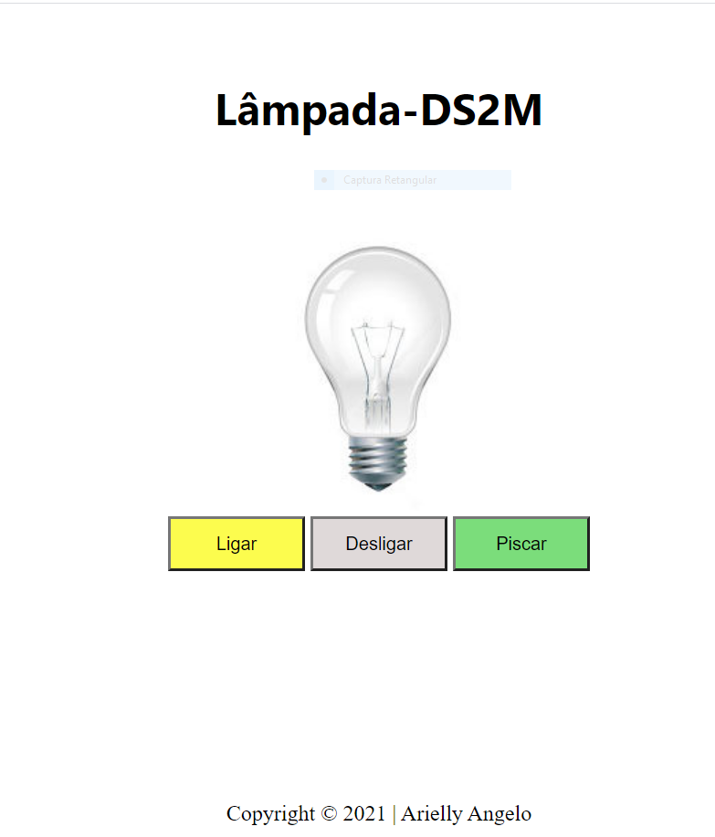

# Lâmpada-PWFE

Projeto criado com o objetivo didático para as aulas de PWFE do curso de Desenvolvimento de Sistemas do [Senai Jandira](https://jandira.sp.senai.br/), sob orientação do professor [Fernando Leonid](https://github.com/FernandoLeonid). 

O projeto consiste em criar uam lâmpada que tenha três ações:

*ligar;

*desligar;

*quebrar.

Todo o código foi construido seguindo as boas práticas, como responsabilidade única e funções puras.
 

